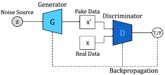

# Génération de Données Synthétiques avec GAN

Ce projet implémente un Generative Adversarial Network (GAN) pour générer des données synthétiques d'utilisation d'applications. Il est basé sur le tutoriel [Synthetic Data Generation with Generative AI](https://amanxai.com/2024/10/14/synthetic-data-generation-with-generative-ai/).

## Structure du Projet

```
.
├── data/
│   └── screentime_analysis.csv    # Données d'origine
├── data_gen_utils.py             # Fonctions utilitaires pour le GAN
└── explore.ipynb                 # Notebook d'exploration et démonstration
```

## Data Generation using genAI



GANs are a type of neural network used to generate new and realistic data such as images, text, or audio. They were introduced by Ian Goodfellow in 2014.

A GAN consists of two main parts:

1. Generator

    This is a neural network whose goal is to create artificial data.
    It takes a random vector (called noise) as input and produces synthetic data.
    The generator aims to fool the discriminator by producing samples realistic enough to be mistaken for real data.

2. Discriminator

    This is another neural network that acts as a binary classifier.
    It receives either real data (from the true dataset) or generated data from the generator.
    Its task is to distinguish real data from fake (generated) data.
    It outputs a probability indicating whether the input is real or generated.

### How the GAN Works

The two networks are trained simultaneously in a zero-sum game (a kind of competition):

- The generator improves to produce increasingly realistic data to fool the discriminator.
- The discriminator improves to better detect fake data.

This adversarial training pushes both networks to improve until the generator creates data almost indistinguishable from real data.


## Fonctionnalités

- Génération de données synthétiques via GAN
- Prétraitement automatique des données
- Visualisation des distributions
- Évaluation de la qualité des données générées


## Utilisation

### Via le Notebook

1. Ouvrir `explore.ipynb` dans Jupyter
2. Suivre les cellules du notebook pour :
   - Charger et prétraiter les données
   - Configurer et entraîner le GAN
   - Générer des données synthétiques


## Architecture du GAN

### Generator
- Input : Vecteur de bruit aléatoire (dimension 100)
- Couches denses avec LeakyReLU et BatchNormalization
- Output : Données synthétiques (3 features)

### Discriminator
- Input : Données réelles ou synthétiques
- Couches denses avec LeakyReLU
- Output : Classification binaire (réel/synthétique)

## Paramètres Configurables

- `latent_dim` : Dimension du vecteur de bruit (default: 100)
- `nb_epochs` : Nombre d'époques d'entraînement (default: 10000)
- `batch_size` : Taille des batchs (default: 128)